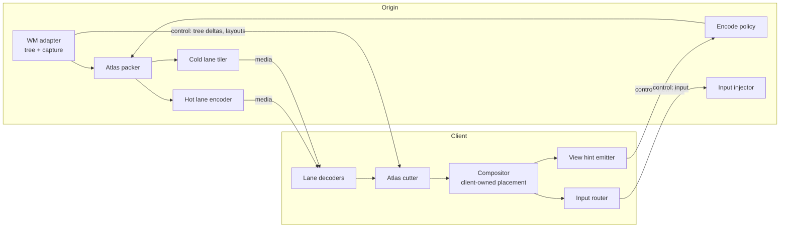
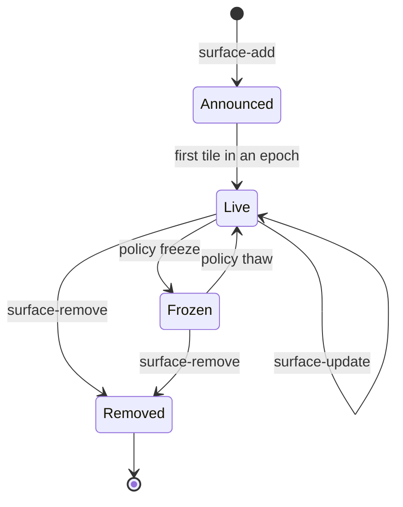

# Telesthete Spatial Surfaces — Design Doc

2026-09-21 · @Someone

## Summary

This extension adds **spatial surfaces** to Telesthete: origins stream individual windows, packed into a few atlas video lanes, to any client that places them in its own space. Clients report what they can see; origins decide how to encode it. Head motion never crosses the network, because clients composite windows locally as textures.

### Goals

- Stream individual windows (plus their popups and dialogs) from Linux and Windows origins, with Android as a later origin.
- Keep encoder and decoder sessions per origin to 1–3, regardless of window count, via atlas packing.
- Let clients drive quality through view hints: out-of-view windows freeze, distant ones drop resolution, focused ones get priority.
- Stay client-agnostic: the same protocol serves a VR headset, AR glasses on a phone, a flat Android multi-window desktop, a Linux client and a Windows client.
- Keep text sharp: static text must not go through 4:2:0 video.
- Allow windows from several origins on the band to share one client space.

### Non-goals

- macOS origins or clients.
- 3D placement in the protocol. Placement is always client-owned.
- Streaming rendered eye views (that is WiVRn/ALVR territory).
- Audio in v1. Reserve a lane type for it, but defer the design.
- A production-grade client UI. The prototype needs only enough client to prove the protocol.

## Context

Telesthete is the peer-to-peer transport under the Rook wire protocol: UDP with ChaCha20-Poly1305 (IETF baseline; optional AES-256-GCM) and a 27-byte frame header, a band hub reached on udp/7474, and workers across the homelab. Custom Rook caps use hyphen delimiters. **The authoritative spec and code live in `~/rook` on cachyrig; other branches and worktrees are stale.** The code agent must read the existing frame header and channel model there before implementing anything in this doc. Where this doc and the existing spec disagree, the existing spec wins and this doc gets amended.

### Why per-window streaming

Existing VR streaming (WiVRn, ALVR, Steam Frame foveated streaming) sends rendered eye views, so every head turn is a network round trip. This design streams windows as textures instead. The client composites quads at display rate, and only content changes cross the network.

The client's job shrinks to three things: decode a few video lanes, composite quads, and route input. That makes phones, SBCs, handhelds and headsets interchangeable clients.

## Architecture

Each **origin** (a host with windows) runs a surface server. Each **client** (a device with a display) runs a surface compositor. They connect over Telesthete. A client may subscribe to several origins at once.

The diagram splits traffic into two channel classes: media (lossy, fragmented, loss-tolerant) and control (reliable, ordered).

Key terms:

- **Surface**: one window-manager window (toplevel, dialog, popup or tooltip), identified by an origin-scoped `surface_id`.
- **Lane**: one encoded stream from an origin. `hot` lanes carry video for motion-heavy surfaces. `cold` lanes carry lossless damage tiles for text-heavy surfaces.
- **Atlas**: a lane's frame, packed with surface tiles. The client cuts tiles back out using the layout for that frame's epoch.
- **Epoch**: a version number for an atlas layout. Every media frame carries the epoch it was packed with.
- **View hint**: a client report of how a surface is currently displayed. Hints are the only input to encode policy.

## Surface model

The surface tree is **mirrored state**. The origin owns the truth; each client holds a replica. On subscribe or reconnect, the origin sends a full snapshot, then deltas. Every snapshot and delta carries a monotonic `tree_rev`. A client seeing a gap in `tree_rev` requests a fresh snapshot. It never tries to patch across the gap.

### Surface fields

| Field | Type | Notes |
| --- | --- | --- |
| `surface_id` | u32 | Origin-scoped, never reused within a session |
| `role` | enum | `toplevel`, `dialog`, `popup`, `tooltip` |
| `parent_id` | u32 or null | Null only for toplevels |
| `anchor` | rect (i32 x, y, u32 w, h) | Position relative to the parent's content origin; ignored for toplevels |
| `size` | u32 w, h | Current content size in origin pixels |
| `size_min`, `size_max` | u32 w, h | From WM hints; 0 means unconstrained |
| `modal` | bool | Client should block input to the parent while this is open |
| `app_id`, `title` | string | UTF-8, title capped at 256 bytes |
| `z_hint` | i32 | Stacking order among siblings |
| `content` | lane\_id, epoch, tile rect | Where this surface's pixels live; updated with atlas layouts |
| `flags` | bitfield | `focused`, `urgent`, `fullscreen_req`, `decorated` |

### Lifecycle

A surface is shown only once it has content in a live epoch. Clients render `Frozen` surfaces from their last cut tile.

### Placement rules for clients

- Toplevels: placed wherever the client likes, and remembered by `app_id` plus title per origin.
- Dialogs: placed in front of the parent, slightly toward the viewer, by default.
- Popups and tooltips: must be placed exactly at `anchor` on the parent's plane. Menus are useless otherwise.
- A client may ignore `z_hint` between toplevels but must honor it among popup siblings.

## Media lanes and atlas packing

Each origin runs at most one hot lane and one cold lane per subscribed client in v1. That is two encoder sessions on the origin and one decoder plus one tile decompressor on the client, however many windows are open. Policy assigns each surface to exactly one lane and may move it.

### Hot lane (video)

- Codec negotiated from client caps, in preference order: AV1, HEVC, H.264. 4:2:0 8-bit is the baseline.
- Atlas canvas: fixed per epoch, up to the client's advertised max decode size (default 3840x2160). Growing the canvas forces a new epoch and a keyframe.
- **Tile alignment:** every tile's origin and size snap to 64 px (the largest common CTU) with a **16 px gutter** on each side. Gutters are filled by edge-replicating the tile, so motion vectors that bleed across the edge sample plausible pixels. The client cuts the inner rect only.
- **Per-tile quality:** use QP-delta or ROI maps (NVENC emphasis maps, VAAPI ROI) derived from policy. If the encoder lacks ROI support, fall back to downscaling low-priority tiles at the next repack.
- **Loss recovery:** prefer intra-refresh (rolling) over periodic IDR. Keyframes are reserved for epoch changes, stream start, and explicit client `lane-resync` requests.
- Frame rate: variable. The encoder emits a frame only when some tile in the lane has damage, capped at the client's display rate.

### Cold lane (lossless tiles)

- Surfaces with mostly static text (terminals, editors, documents) go here.
- Damage is tracked in 64x64 blocks. Each damaged block is sent as a QOI-compressed payload, or zstd over raw BGRA if QOI loses, keyed by `(surface_id, block_x, block_y, surface_rev)`.
- There is no atlas cut on the client. It blits blocks straight into a per-surface texture, so cold surfaces are never subject to chroma subsampling.
- Scrolling is the main cost. v1 accepts full re-sends of damaged blocks; a later `copy-rect` op (move existing pixels, then send only new rows) is reserved but not required.

### Atlas layout and epochs

- Allocator: skyline or shelf packing, sorted by height. Leave 15–25% slack so a moderately grown window fits without a repack.
- A **repack** happens only when a surface can't fit, the canvas must grow, or a batch of de-res changes is pending. A repack bumps `epoch`, triggers a keyframe on that lane, and sends `atlas-layout` on the control channel before the first frame of the new epoch.
- Every hot-lane frame carries `(lane_id, epoch, frame_seq)` in its media header. The client keeps the last 2 layouts and discards frames whose epoch it doesn't hold, then sends `lane-resync`.
- Surface resize without a repack: the tile keeps its slot. The origin writes the new content into the top-left and flags the valid sub-rect in `surface-update`.

### Lane assignment heuristics (v1, origin side)

- Start every surface on cold.
- Promote to hot when more than 30% of a surface's blocks are damaged per frame for more than 1 s, or when `app_id` is on a hot-allowlist (browsers playing video, games, players).
- Demote to cold after 3 s below 5% damage per frame.
- A promotion or demotion counts as a layout change, so batch them into the next repack.

## View hints and encode policy

Clients describe what they see; origins decide what to encode. A client never requests bitrates, codecs or resolutions per surface. This single rule is what keeps every client type interchangeable.

### View hint fields (per surface)

| Field | Type | Meaning |
| --- | --- | --- |
| `visible` | enum | `in_view`, `peripheral`, `out_of_view`, `hidden` (minimized or occluded by the client) |
| `display_px` | u32 w, h | Physical display pixels the surface currently covers on the client after projection |
| `fovea` | u8 0–255 | Gaze or center proximity: 255 = under the gaze or screen center |
| `focused` | bool | Has client input focus |
| `priority` | u8 | User pin or boost; 128 = neutral |

Clients send a full hint set at 10 Hz maximum, and immediately on a `visible` transition or a `display_px` change greater than 25%. Flat clients send `fovea` = 255 for every on-screen surface.

### Policy (origin side, v1)

- `out_of_view` or `hidden`: freeze. The surface stops being encoded, and its tile stays in the atlas until the next repack. Thaw on return with an immediate refresh of that tile (an intra-refresh region on hot, a full block resend on cold).
- Target resolution = `min(size, display_px × 1.25)`. If the target falls below 70% of the current tile size for more than 2 s, queue a de-res for the next repack. Queue a re-res immediately when the target exceeds 110% of the tile.
- QP delta on hot tiles scales with `fovea`, `focused` and `priority`: focused plus fovea 255 gets the best QP; `in-view but unfocused gets about +4; peripheral gets about +8; peripheral and unfocused gets about +12`.
- Cold lane: `peripheral` surfaces are rate-limited to 5 Hz of block updates; in-view surfaces get no limit.
- Lane bitrate: the origin runs one congestion controller per client and splits its budget across lanes. Cold traffic takes priority, since stale text is worse than soft video.

Policy is a pure function of the surface tree, damage stats, hints and network estimates. Implement it as a separately testable module.

## Input, focus, resize and clipboard

All input is expressed in **surface-local coordinates** in origin pixels. The client does the raycast or touch hit test against its own placement and converts to the surface's pixel space. The origin never learns anything about 3D.

- **Pointer:** `motion(surface_id, x, y)`, `button(surface_id, button, pressed)`, `axis(surface_id, dx, dy, discrete)`. Pointer motion is coalesced to the client display rate and sent unreliable-latest-wins; button and axis events are reliable and ordered.
- **Keyboard:** evdev keycodes plus a modifier bitmap, sent to the focused surface. The origin keeps its own keymap; the client never translates layouts.
- **Text input:** a `text-commit(surface_id, utf8)` message for IME and on-screen keyboards on Android clients. The origin injects it as text input where supported, falling back to key synthesis.
- **Touch:** `touch(surface_id, slot, phase, x, y)`, mapped by the origin to native touch or to pointer emulation.
- **Focus:** the client sends `focus-request(surface_id)`. The origin answers with a `flags.focused` change in the tree. The origin's WM stays authoritative, because Windows in particular may refuse focus changes.
- **Resize:** the client sends `resize-request(surface_id, w, h)`, clamped to min and max. The client scales the current texture until `surface-update` reports the new size, and never stretches beyond 10% without letterboxing.
- **Close and minimize:** `close-request` and `hide-request`. The origin decides.
- **Clipboard:** `clipboard-offer(mime_types)` in either direction, with data sent on `clipboard-request`. Text only in v1; cap at 1 MiB.

## Message catalog and capabilities

All control messages use Rook's hyphen-delimited cap naming. Encoding follows whatever the existing Rook wire protocol uses for control payloads. The code agent should check `~/rook` rather than invent a new serialization.

| Message | Direction | Channel | Payload |
| --- | --- | --- | --- |
| `surface-hello` | C → O | control | Client caps (below), protocol version |
| `surface-welcome` | O → C | control | Origin caps, chosen codec per lane, session id |
| `surface-snapshot` | O → C | control | `tree_rev`, all surfaces, current layouts |
| `surface-add` / `surface-update` / `surface-remove` | O → C | control | `tree_rev` + changed fields |
| `atlas-layout` | O → C | control | `lane_id`, `epoch`, canvas size, `[(surface_id, tile rect, valid rect)]` |
| `view-hint` | C → O | control, latest-wins | Per-surface hint set |
| `surface-input` | C → O | control (pointer motion latest-wins) | Pointer, key, text, touch events |
| `focus-request` / `resize-request` / `close-request` / `hide-request` | C → O | control | `surface_id` + args |
| `clipboard-offer` / `clipboard-request` / `clipboard-data` | both | control | MIME types or data |
| `lane-resync` | C → O | control | `lane_id`, last good `epoch` and `frame_seq` |
| `snapshot-request` | C → O | control | Last seen `tree_rev` |
| `lane-frame` | O → C | media | Media header + encoded frame fragments |
| `cold-blocks` | O → C | media | Batched damage blocks |

### Client capabilities

- Decoders: list of `(codec, max_w, max_h, max_fps, max_instances, chroma)`.
- Cold lane: supported tile codecs (`qoi`, `zstd-bgra`).
- Input: pointer, keyboard, touch, text-input, 6DoF ray (informational only).
- Display: refresh rate, and whether it is flat or spatial (informational only; it must not change origin behavior).

### Origin capabilities

- Encoders: list of `(codec, max_sessions, roi_support, intra_refresh_support)`.
- Input injection fidelity: `full`, `focused-only` (Windows SendInput) or `none`.
- Clipboard: supported.

## Transport mapping

Control and media must never share a delivery queue. An input event or view hint must not wait behind a lost video fragment. Map them onto Telesthete as separate logical channels, reusing whatever channel or stream multiplexing the existing frame header provides. If none exists, add a channel id to the payload envelope, not to the 27-byte header, unless the spec already reserves room for one.

### Media channel

- Fragment frames to fit the path MTU (default 1200-byte payloads, same as QUIC's safe default).
- The media header per fragment is `(lane_id u8, epoch u16, frame_seq u32, frag_idx u16, frag_count u16, flags u8)`, where the flags mark keyframe and intra-refresh-complete. That totals 12 bytes, inside the encrypted payload.
- Loss handling: NACK-based retransmit for fragments of keyframes, the first frame of an epoch, and cold blocks. Plain delta frames are not retransmitted; intra-refresh heals them. Optional XOR FEC per frame is reserved for v2.
- Frames arriving after the next frame of the same lane has completed are dropped.

### Control channel

- Reliable and ordered, with the exception of the two latest-wins streams (`view-hint`, pointer motion), which carry a sequence number and are simply superseded.
- Must keep working while media is saturated. Give control a strict-priority send queue on the origin.

### Discovery and the band

- Origins advertise a `surface-origin` cap on the band, with a display name and current surface count.
- Clients discover origins through the hub, then connect peer-to-peer over Telesthete as existing workers do. Media must never relay through the hub unless peer-to-peer fails, and the client must surface that state.

## Platform adapters

The protocol and the policy module are platform-neutral. Each platform supplies an origin adapter (tree, capture, damage, input injection) and/or a client shell (decode, composite, input, hints).

### Linux origin (KWin) — prototype target

- **Tree:** a KWin script or plugin that exports windows, transient-for parents, roles, geometry and focus over D-Bus to the surface server.
- **Capture:** per-window PipeWire screencast streams via KWin's screencast support, with dmabuf import for zero-copy into the encoder where possible.
- **Damage:** from PipeWire buffer metadata; otherwise, diff 64x64 blocks on the CPU for cold surfaces.
- **Occlusion:** occluded windows may stop repainting. Run remoted windows on a large headless virtual output with no overlap.
- **Encode:** GStreamer or FFmpeg on VAAPI (AMD, Intel) or NVENC (kaiju).
- **Input:** libei, which KWin supports, with events targeted at the surface's current screen position on the virtual output.

### Windows origin

- **Tree:** EnumWindows plus GetWindow(GW\_OWNER) for owned dialogs and popups; SetWinEventHook for create, destroy, move and focus.
- **Capture:** Windows.Graphics.Capture per HWND. This works for occluded windows but not minimized ones, so the adapter must keep remoted windows restored (off-screen if needed).
- **Encode:** Media Foundation or NVENC/AMF directly.
- **Input:** SendInput needs foreground focus, so advertise `focused-only` fidelity. PostMessage-based injection can be an opt-in per-app fallback.

### Android origin (later)

- Launch each remoted app on its own VirtualDisplay to get per-app capture. MediaProjection alone is whole-display only.
- Tree data is limited; treat each VirtualDisplay as a single toplevel in v1.

### Clients

| Client | Shell | Decode | Notes |
| --- | --- | --- | --- |
| Quest 3 | StereoKit (OpenXR) | MediaCodec | 6DoF ray input; hints from real projection |
| Android phone + glasses | Android app; Presentation API on the DP-out display | MediaCodec | 3DoF from the glasses' SDK; phone screen as trackpad and keyboard |
| Android flat multi-window | Same app, 2D mode | MediaCodec | Hints from on-screen window size; `fovea` = 255 |
| Linux (Monado or desktop) | StereoKit on Monado, or a flat wlroots/Qt window | VAAPI or V4L2 | Includes the SDM845 postmarketOS test client |
| Windows | StereoKit or a flat D3D11 window | Media Foundation | Low priority |

StereoKit is the suggested client toolkit because one codebase covers Quest, Android and Linux. It is a suggestion, not a requirement of the spec.

## Prototype plan

Build the thinnest working vertical slice first, then widen. Each milestone ends with a demo and a short findings note appended to this doc.

**Ground rules for the code agent**

- Implement in this repository (`~/telesthete-kvm` on cachyrig), per the repository owner’s 2026-09-21 direction. Read `~/rook` and its Telesthete dependency as the authoritative transport references before writing runtime code.
- Put the protocol types and the policy module in a platform-neutral library with unit tests. Keep adapters and shells thin.
- Measure from M1 onward: glass-to-glass latency (a timestamp overlay in a test window), bitrate per lane, encode and decode time per frame, and tiles repacked per minute.
- Don't optimize past a milestone's goal. Log findings instead.

**Milestones**

1. **M0 — Spec delta.** Write the message schemas in the repo's existing style, plus a decision on the channel mapping. No runtime code yet.
2. **M1 — One window, one lane.** KWin origin on cachyrig streams one window via PipeWire and hardware H.264 (NVENC on cachyrig; VAAPI where supported), with no atlas yet. A Linux flat client on the same LAN decodes it and shows it in a plain window. Pointer and keyboard input work.
   - Done when a terminal is usable remotely, and latency and bitrate are logged.
3. **M2 — Surface tree.** Add the KWin script, snapshot and deltas, popups at anchors, and focus and resize requests.
   - Done when right-click menus and a file dialog work on a remoted app.
4. **M3 — Hot atlas.** Several windows in one hot lane with 64 px alignment, gutters, epochs and `atlas-layout`. The client cuts tiles.
   - Done when 6 windows run through 1 encoder session and a repack shows no bleed or stale-layout frames.
5. **M4 — Cold lane.** Add QOI damage blocks, promotion and demotion, and text-sharpness checks.
   - Done when an editor side by side with a video shows crisp text and moving video, and the 4:2:0 text smear is gone.
6. **M5 — View hints and policy.** Add freeze and thaw, de-res at repack, QP deltas where the encoder supports ROI, and the congestion split.
   - Done when windows behind the viewer drop to \~0 bitrate and a distant window visibly drops resolution, then restores.
7. **M6 — Spatial client.** A StereoKit client on the Quest 3 over Wi-Fi or USB, and the same code on Android with glasses.
   - Done when windows from cachyrig and kaiju share one space.
8. **M7 — Windows origin.** Add the WGC capture, window tree and `focused-only` input.
   - Done when a Windows app sits beside Linux windows in the same client space.

## Risks and open questions

### Risks

| Risk | Impact | Mitigation |
| --- | --- | --- |
| Motion vectors bleed across tiles | Edge artifacts on cut tiles | 64 px alignment, 16 px edge-replicated gutters; test in M3 |
| ROI or QP maps unsupported on some encoders | No per-tile quality inside a hot lane | Fall back to de-res at repack; lean on the cold lane for text |
| Repack keyframes spike bandwidth | Stutter during window churn | Slack in the allocator, batched repacks, intra-refresh elsewhere |
| KWin occluded windows stop painting | Frozen or black tiles | Headless virtual output with no overlap |
| Windows input requires foreground focus | Unreliable input to background windows | `focused-only` fidelity plus focus-follows-client-pointer |
| Mobile decoders limit instance counts | Lanes exceed client capacity | Clients advertise `max_instances`; the origin never exceeds it |
| Scrolling floods the cold lane | Bandwidth spikes in editors and terminals | Rate limit in v1; `copy-rect` op in v2 |

### Open questions

- [x] The existing 27-byte header has a u16 channel id; retain it. See the M0 protocol delta.
- [x] Current Rook workers use UTF-8 JSON capability envelopes (the transport spec’s msgpack note is stale relative to worker code). Snapshot sizing and fragmentation are specified in the M0 delta; runtime measurements remain for M1.
- [ ] One hot lane per origin per client, or one hot lane per origin shared across clients (simulcast)? v1 assumes per-client.
- [ ] Should cold-lane blocks be deduplicated across surfaces (identical UI chrome)? Probably not worth it in v1.
- [ ] Should audio be a third lane type, and does it need per-surface routing or just per-origin?
- [ ] Authentication and authorization per origin: which band identities may subscribe to which origin's surfaces?

## M0 findings — 2026-09-21

The [protocol delta](spatial-surfaces-protocol.md) records the message schemas,
channel mapping, source revisions and transport prerequisites. This repository
is the implementation home; Rook remains the integration reference. No spatial
runtime or demo exists yet.

The existing header already provides channel IDs. Current Rook workers use JSON
and a hub-routed adapter which fragments messages but does not implement the
reliable Channel state machine. The underlying Telesthete library does provide
reliable Channels. Direct peer negotiation, queue separation and explicit relay
status require integration work in M1; they cannot be assumed from that adapter.

The cipher correction above follows the existing spec. Channel data uses a
1024-byte budget; the 1200-byte budget in this design applies to media datagrams,
including framing overhead. Latest-wins hints and motion use separate Streams.
Static-text quality remains an M4 acceptance criterion; M1 H.264 is an explicit
intermediate prototype. Authorization per origin remains unresolved and must be
settled before accepting subscriptions outside explicitly configured test peers.

## Native prototype findings — 2026-09-21

The [running prototype](spatial-prototype.md) and [measured evidence](spatial-test-output.md)
now live in this repository. Both cold and hot paths work from KWin into a flat
client over encrypted UDP. Six native windows passed through one NVENC atlas.
Windows WGC, foreground SendInput and cold streaming passed on win11-flophouse.
This is progress across several milestones, not completion of M1–M7 acceptance.

Cachyrig's RTX 2070 supports NVENC H.264; its VAAPI entry point cannot encode.
M1's encoder choice above is amended accordingly. Capture crops must use KWin
client geometry and Windows DWM visible frame bounds; generic frame rectangles
include decoration or invisible resize borders.

Protocol additions: `lane-status` on reliable control detects a completely lost
media batch; `surface-ping` maintains the input lease. A button may include its
surface-local `x,y` so a lost motion datagram cannot put a click at an older
position. Large full hint sets use the media fragment header on their own Stream
(lane id 2, epoch 0, monotonically increasing hint sequence), applied atomically.
Cold batches are not discarded merely because a later independent batch completes.

The current runner uses configured direct peers, explicit hot/cold mode and full
replacement tree snapshots. Automatic migration/policy application, clipboard,
band route discovery, native spatial shells and true glass-to-glass measurements
remain open. See the prototype guide for the full implementation gap list.

### Subsequent desktop integration

The runtime now supports `--lane auto`: live cold/hot assignment with a reliable
per-surface frame fence and staging until destination pixels are complete.
Native KWin/NVENC and Windows WGC/software-H.264 runs both completed cold → hot
→ cold transitions without session errors. Sparse capture uses a 0.5-second
recent-damage estimate. In-slot resizes retain atlas allocations and encoder,
advancing the immutable crop epoch with a keyframe. Visible Qt client resize
checks on both operating systems changed the actual source and decoded texture
to 640×320. Focus loss releases origin input over reliable control. These findings
supersede the earlier notes about fixed lanes and unconditional resize repacking.
See `spatial-test-output.md` for exact results and remaining acceptance gaps.
